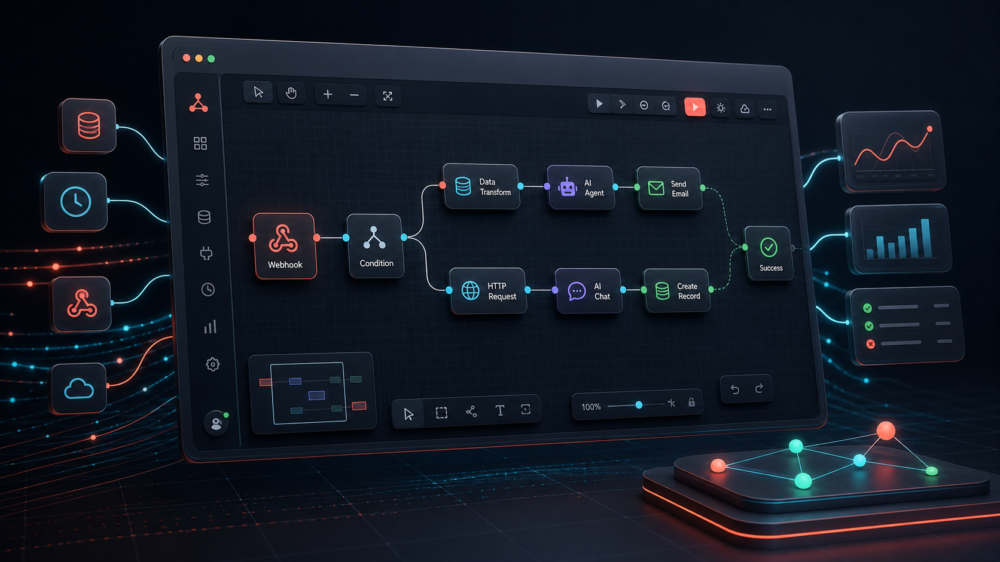
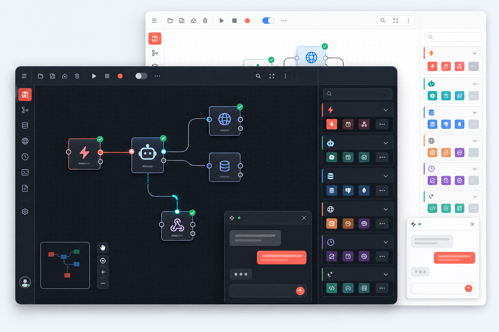

# FlowSharp



> 🌐 **Languages:** [English](README.md) · [Türkçe](README.tr.md)

An enterprise-grade **workflow automation** platform built with **C# / .NET 10 and Blazor**. It ships with a node-based visual flow designer, real executable nodes, AI agent support, scheduled/webhook triggers, and a **hot-loadable community plugin system**.



---

## Table of Contents

- [Features](#features)
- [Architecture](#architecture)
- [Libraries Used](#libraries-used)
- [Built-in Nodes](#built-in-nodes)
- [Prerequisites](#prerequisites)
- [How to Install](#how-to-install)
- [Configuration (appsettings.json)](#configuration-appsettingsjson)
- [Roles and Permissions](#roles-and-permissions)
- [Plugin System (Community Nodes)](#plugin-system-community-nodes)
- [Writing a New Node](#writing-a-new-node)
- [Webhook and Response (Respond to Webhook)](#webhook-and-response-respond-to-webhook)
- [Project Structure](#project-structure)
- [Sponsorship & Support](#sponsorship--support)
- [License](#license)
- [Troubleshooting](#troubleshooting)
- [Contributing](#contributing)

---

## Features

- 🎨 **Visual Workflow Designer** — add/connect nodes, category & search filters, parameter editing.
- ⚡ **Real Executable Nodes** — HTTP, email (SMTP/IMAP), PostgreSQL, Slack/Telegram/Discord, logic (IF/Switch/Filter/Merge), data transforms, and JavaScript (Jint).
- 🤖 **AI Agent** — via Semantic Kernel: OpenAI, Azure OpenAI, Anthropic, Gemini, Groq, Mistral, Cohere, HuggingFace, OpenRouter, and Ollama; supports attaching tools.
- ⏰ **Triggers** — Manual, Cron schedule, Webhook (can return a synchronous response), IMAP email, and Chat.
- 🔌 **Hot Plugin System** — raw `.cs` files dropped into `plugins/` are compiled at runtime with **Roslyn**; nodes are added **without rebuilding** the main app.
- 🛒 **Admin Marketplace** — download, install, reload, and remove plugins from a GitHub repository.
- 🔐 **Identity & Authorization** — ASP.NET Core Identity + role/permission policy infrastructure.
- 📡 **Real Time** — live node execution status via SignalR (Redis or in-memory fallback).
- 🧮 **Expression Engine** — `{{ $json.field }}`, `{{ $node["Name"].json }}`, `{{ $now }}`, etc., with **live validation** (green/red) in the designer.
- 📝 **Logging** — Serilog console and rolling file sinks.

---

## Architecture

| Layer | Technology |
|---|---|
| UI | Blazor Web App (interactive server render) |
| Backend | ASP.NET Core (.NET 10) |
| Real time | SignalR + Redis (or in-memory) |
| Database | PostgreSQL |
| ORM | EF Core + JSONB workflow definition |
| Identity | ASP.NET Core Identity |
| Authorization | role/permission policies (`AppPermissions`) |
| Queue | PostgreSQL-backed `workflow_jobs` table |
| Worker | separate `BackgroundService` project |
| Plugins | Roslyn runtime compilation + `AssemblyLoadContext` |
| AI | Microsoft Semantic Kernel |
| Logging | Serilog (console + file) |

---

## Libraries Used

| Package | Version | Purpose |
|---|---|---|
| `Microsoft.SemanticKernel` | 1.77.0 | AI Agent and chat models |
| `MailKit` | 4.17.0 | SMTP sending and IMAP reading |
| `Jint` | 4.9.2 | Code node — sandboxed JavaScript |
| `CsvHelper` | 33.0.1 | CSV node — read/write CSV |
| `AngleSharp` | 1.1.2 | HTML Extract node — CSS selector parsing |
| `ClosedXML` | 0.104.2 | Spreadsheet node — Excel (.xlsx) reading |
| `Microsoft.Data.Sqlite` | 10.0.0 | RAG — SQLite vector store (per workspace) |
| `SmartComponents.LocalEmbeddings` | 0.1.0-preview10148 | RAG — local/in-process embeddings (bundled ONNX) |
| `Npgsql.EntityFrameworkCore.PostgreSQL` | 10.0.2 | PostgreSQL + EF Core |
| `Microsoft.EntityFrameworkCore.Design` / `.Tools` | 10.0.8 | Migration tooling |
| `Microsoft.AspNetCore.Identity.EntityFrameworkCore` | 10.0.8 | Identity storage |
| `Microsoft.CodeAnalysis.CSharp` (+ Workspaces) | 5.3.0 | **Roslyn** — runtime plugin compilation |
| `StackExchange.Redis` | 2.13.17 | SignalR event backplane (multi-process) |
| `Cronos` | 0.13.0 | Cron expression parsing (scheduler) |
| `Serilog.AspNetCore` / `Sinks.Console` / `Sinks.File` | 10.0.0 / 6.1.1 / 7.0.0 | Logging |
| `Microsoft.Extensions.Hosting` | 10.0.8 | Worker host infrastructure |

---

## Built-in Nodes

All nodes are **auto-discovered** as `INodeType` implementations and appear in the palette under their category.

### Triggers
| Key | Name | Description |
|---|---|---|
| `manual.trigger` | Manual Trigger | Starts the flow manually |
| `schedule.trigger` | Schedule Trigger | Runs periodically via a cron expression |
| `webhook.trigger` | Webhook | Starts on an incoming HTTP request (can respond synchronously) |
| `email.imap.trigger` | Email Trigger (IMAP) | Triggers when new mail arrives in the inbox |
| `chat.trigger` | AI Chat UI | Triggers from the chat interface |
| `flow.executeWorkflowTrigger` | Execute Workflow Trigger | Starts when called by another workflow |
| `error.trigger` | Error Trigger | Runs when a workflow fails |

### Core / Logic
| Key | Name | Description |
|---|---|---|
| `if.condition` | IF | Branches true/false on a condition |
| `switch.condition` | Switch | Branches to multiple outputs |
| `filter.items` | Filter | Passes items matching a condition |
| `merge.items` | Merge | Combines multiple inputs |
| `set.fields` | Set | Adds/edits fields |
| `no.op` | No Operation | Passes data through unchanged |
| `code.javascript` | Code | Runs sandboxed JavaScript (Jint) |
| `flow.wait` | Wait | Pauses the flow for a given duration |
| `flow.stopAndError` | Stop And Error | Stops the flow with a custom error message |
| `flow.executeWorkflow` | Execute Workflow | Runs a sub-workflow and returns its output |
| `flow.loopOverItems` | Loop Over Items | Processes items in batches; `loop`/`done` outputs |

### Data / Transform
| Key | Name | Description |
|---|---|---|
| `sort.items` | Sort | Sorts items by a field |
| `limit.items` | Limit | Caps the number of items |
| `aggregate.items` | Aggregate | Collapses all items into one |
| `split.out` | Split Out | Splits an array field into separate items |
| `datetime.action` | Date & Time | Produces or formats date/time |
| `transform.crypto` | Crypto | Hash / HMAC / Base64 operations |
| `transform.csv` | CSV | Converts items to CSV or parses CSV into items |
| `transform.htmlExtract` | HTML Extract | Extracts data from HTML via CSS selectors |
| `transform.spreadsheet` | Spreadsheet | Reads an uploaded Excel/CSV file; each row becomes an item |

### HTTP
| Key | Name | Description |
|---|---|---|
| `http.request` | HTTP Request | Full REST request with selectable method |
| `http.get` / `http.post` / `http.put` / `http.patch` / `http.delete` | HTTP GET/POST/... | Fixed-method requests |
| `webhook.response` | Respond to Webhook | Returns a custom response to the webhook caller |

### Database
| Key | Name | Description |
|---|---|---|
| `postgres.query` | Postgres | Runs a SQL query (select/execute) |

### Communication
| Key | Name | Description |
|---|---|---|
| `email.send` | Send Email | Sends email over SMTP (MailKit) |
| `telegram.message` | Telegram | Sends a Telegram message |
| `slack.message` | Slack | Sends a Slack channel message |
| `discord.message` | Discord | Sends to a Discord webhook |

### AI
| Key | Name | Description |
|---|---|---|
| `ai.agent` | AI Agent | Tool-calling AI agent |
| `openai.chat` / `azureopenai.chat` / `anthropic.chat` / `gemini.chat` / `groq.chat` / `mistral.chat` / `cohere.chat` / `huggingface.chat` / `openrouter.chat` / `ollama.chat` | *Provider* Chat | Direct chat completion |
| `*.chatmodel` | *Provider* Chat Model | Model sub-node attached to AI Agent |
| `tool.httpRequest` | HTTP Request Tool | HTTP tool for the agent |
| `tool.calculator` | Calculator | Calculator tool for the agent |
| `rag.insert` | Vector Store: Insert | Embeds texts into the SQLite vector store (RAG) |
| `rag.query` | Vector Store: Query | Semantic search over the vector store (RAG) |

---

## Prerequisites

- [.NET 10 SDK](https://dotnet.microsoft.com/download)
- **PostgreSQL** (default: `localhost:5432`)
- **Docker** (optional, to run Redis and/or Postgres in containers)
- Redis (optional; an in-memory fallback is used if absent)

---

## How to Install

### ⚡ Quick Start (Docker Compose)

The easiest way to run the complete FlowSharp stack (PostgreSQL, Redis, Web UI, and Worker) is using Docker Compose:

```bash
docker compose up -d --build
```

Once all containers are running, navigate to `http://localhost:8080` in your browser.
* **Default Admin Credentials:** `admin@flowsharp.local` / `Admin!2345`

---

### 💻 Developer Setup (Local Development)

If you wish to run the components individually for development purposes:

```powershell
# 1) Clone the repository
git clone https://github.com/FlowSharp/FlowSharp.git
cd FlowSharp


# 2) Start helper services (Redis/Postgres)
docker compose up -d

# 3) Restore and build
dotnet restore
dotnet build

# 4) Apply the database schema (migration)
dotnet ef database update `
  --project src/FlowSharp.Infrastructure `
  --startup-project src/FlowSharp.Web

# 5) Run Web and Worker in separate terminals
dotnet run --project src/FlowSharp.Web
dotnet run --project src/FlowSharp.Worker
```

> 💡 **Single-process mode:** set `"Worker": { "RunInWebProcess": true }` in `appsettings.json` to run the Worker inside the web app — no separate Worker terminal needed.

> 💡 **Auto migration:** set `"Database": { "ApplyMigrationsOnStartup": true }` to apply migrations on startup.

The app listens on `https://localhost:7163` and `http://localhost:5094`.

---

## Configuration (appsettings.json)

```jsonc
{
  "ConnectionStrings": {
    "DefaultConnection": "Host=localhost;Port=5432;Database=flowsharp_db;Username=postgres;Password=postgres"
  },
  "Database": { "ApplyMigrationsOnStartup": false },
  "Redis": { "ConnectionString": "localhost:6379" },
  "Worker": { "RunInWebProcess": false },

  // Execution records
  "Executions": { "SaveData": "All", "MaxCount": 1000, "MaxAgeDays": 30 },

  // Plugin system
  "Plugins": {
    "Path": "plugins",
    "OfficialMarketplaceUrl": "https://github.com/FlowSharp/FlowSharp.plugins"
  },

  // Security Encryption Key (MUST be set in production)
  "Security": { "CredentialEncryptionKey": "<strong-random-key>" },

  // First admin user (created only when no users exist)
  "Seed": {
    "Enabled": true,
    "Admin": { "Email": "admin@flowsharp.local", "Password": "Admin!2345" }
  }
}
```

---

## Roles and Permissions

Three roles are seeded on startup: **Admin**, **Editor**, **Viewer**.

| Permission | Description | Admin | Editor | Viewer |
|---|---|:--:|:--:|:--:|
| `workflows.read` | View workflows | ✅ | ✅ | ✅ |
| `workflows.write` | Edit workflows | ✅ | ✅ | — |
| `workflows.execute` | Run workflows | ✅ | ✅ | — |
| `executions.read` | View execution logs | ✅ | ✅ | ✅ |
| `plugins.manage` | Marketplace / plugin management | ✅ | — | — |

---

## Plugin System (Community Nodes)

The community can add new nodes **without rebuilding** the main application using our **Roslyn-powered hot-loadable** system.

### How it Works
1. **Each folder** under `plugins/` is a plugin.
2. All `.cs` files in the folder (including subfolders) are compiled at startup with **Roslyn**.
3. The produced assembly is loaded into a collectible `AssemblyLoadContext`; its `INodeType`s are added to the node registry.

### Installing from the Marketplace (Admin)
1. Open **Marketplace** in the left menu (requires `plugins.manage` permission).
2. Enter a GitHub URL or click "Use official address".
3. Click **Install**. The plugin is downloaded, compiled, and hot-loaded immediately.

---

## Writing a New Node

Example plugin node: `plugins/Sample/HelloNode.cs`:

```csharp
using System.Text.Json.Nodes;
using FlowSharp.Application.Nodes;
using FlowSharp.Domain.Nodes;

namespace Community.Sample;

public sealed class HelloNode : PerItemNodeType
{
    public override NodeDefinition Definition { get; } = new(
        Key: "community.hello",
        DisplayName: "Hello (Plugin)",
        Category: NodeCategory.Core,
        Kind: NodeKind.Action,
        Description: "Adds a greeting to the item.",
        Parameters: [ new NodeParameterDefinition("name", "Name", NodeParameterType.String, DefaultValue: "World") ],
        Tags: ["community"], Icon: "sparkles", Color: "#9b51e0");

    protected override Task<NodeItem?> ProcessItemAsync(INodeExecutionContext context, NodeItem item, int index)
    {
        var name = context.GetString("name", index) ?? "World";
        var output = (JsonObject)item.Json.DeepClone();
        output["greeting"] = $"Hello, {name}!";
        return Task.FromResult<NodeItem?>(NodeItem.From(output));
    }
}
```

---

## Webhook and Response (Respond to Webhook)

- A workflow starting with `webhook.trigger` runs **synchronously** on incoming HTTP requests.
- Endpoint: `/webhook/{path}` — `path` and `method` are matched from the webhook node parameters.

---

## Project Structure

```
src/
├─ FlowSharp.Web            # Blazor UI, Identity, webhook endpoint, marketplace, plugins/
├─ FlowSharp.Worker         # BackgroundService that processes jobs from the queue
├─ FlowSharp.Domain         # Workflow, execution, queue, node, security models
├─ FlowSharp.Application    # Contracts: INodeType, INodeRegistry, IPluginManager, expressions
├─ FlowSharp.Infrastructure # EF Core, queue, runner, engine, plugin manager (Roslyn), scheduler
└─ FlowSharp.Nodes          # All built-in nodes (HTTP, AI, DB, communication, core, transform)
```

---

## Sponsorship & Support

If your company relies on FlowSharp for business-critical automation, we offer several ways to help support the project:

*   **Commercial Support:** Need custom enterprise node development, high-availability deployments, or professional integration assistance? Reach out to us for dedicated support agreements.
*   **GitHub Sponsors:** Sponsor FlowSharp development directly on GitHub to support our roadmap and unlock premium sponsor benefits.
*   **Enterprise Plugins:** Access premium enterprise-grade nodes and features designed for high-scale workflows.

---

## License

This project is licensed under the **Elastic License 2.0 (ELv2)**. 

*   **Free for Use:** You are free to run FlowSharp internally for your own personal projects or within your organization.
*   **No SaaS Reselling:** You cannot offer FlowSharp as a managed, hosted service to third parties.
*   **Branding & Copyrights:** You must retain all "FlowSharp" branding, copyright notices, and attribution headers.

For more details, see the [LICENSE.md](LICENSE.md) file.

---

## Contributing

We welcome community contributions! To ensure code quality and prevent double work, we follow an **"Issue-Driven Contribution" (Talk First, Code Later)** model.

Please read our [Contributing Guidelines](CONTRIBUTING.md) before making changes to the Core repository.
